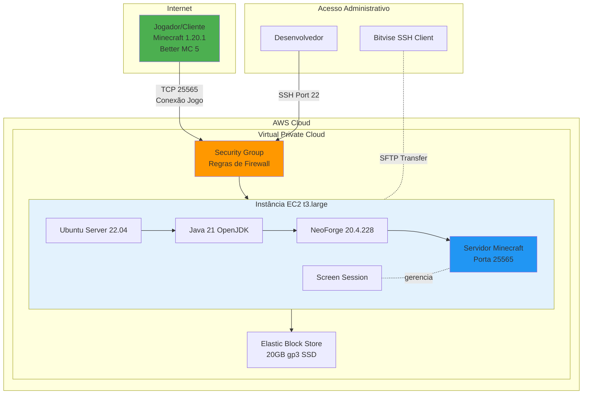

# 🏗️ Arquitetura do Projeto

## Visão Geral

Este documento descreve a arquitetura técnica do servidor Minecraft hospedado na AWS.

## Diagrama de Arquitetura



## Componentes da Arquitetura

### 1. Cliente (Jogador)
**Especificações:**
- Minecraft Java Edition 1.20.1
- Modpack: Better MC 5 (250+ mods)
- Loader: NeoForge 20.4.228
- Conecta via TCP porta 25565

### 2. AWS Security Group
**Função:** Firewall virtual da instância EC2

**Regras de Entrada (Inbound):**
```
| Tipo       | Protocolo | Porta | Origem      | Descrição          |
|------------|-----------|-------|-------------|--------------------|
| SSH        | TCP       | 22    | [Seu IP]    | Acesso SSH         |
| Custom TCP | TCP       | 25565 | 0.0.0.0/0   | Minecraft Server   |
```

**Regras de Saída (Outbound):**
```
| Tipo       | Protocolo | Porta | Destino     | Descrição          |
|------------|-----------|-------|-------------|--------------------|
| All Traffic| All       | All   | 0.0.0.0/0   | Internet (padrão)  |
```

### 3. Instância EC2
**Tipo:** t3.large

**Especificações:**
- vCPUs: 2
- RAM: 8 GiB
- Network: Moderate (até 5 Gbps)
- EBS-Optimized: Sim

**Sistema Operacional:** Ubuntu Server 22.04 LTS
- Kernel: Linux 5.15+
- Shell: Bash
- Package Manager: APT

**Custo:** ~$0.0832/hora (~$20/mês com uso 8h/dia)

### 4. Storage (EBS)
**Tipo:** General Purpose SSD (gp3)

**Especificações:**
- Tamanho: 20 GiB
- IOPS: 3000 (padrão)
- Throughput: 125 MiB/s

**Uso:**
```
/home/ubuntu/minecraft-server/
├── world/          # Mundo do jogo (~2-5 GB)
├── mods/           # Arquivos de mods (~500 MB - 2 GB)
├── config/         # Configurações dos mods (~50 MB)
├── libraries/      # Dependências Java (~200 MB)
├── logs/           # Logs do servidor (~100 MB)
└── backups/        # Backups opcionais
```

### 5. Software Stack

```
┌─────────────────────────────────────┐
│  Minecraft Server (Porta 25565)    │
├─────────────────────────────────────┤
│  NeoForge 20.4.228 (Mod Loader)    │
├─────────────────────────────────────┤
│  Java 21 OpenJDK (JVM)             │
│  -Xmx6G -Xms6G (Heap Memory)       │
├─────────────────────────────────────┤
│  Screen (Process Manager)           │
├─────────────────────────────────────┤
│  Ubuntu Server 22.04 LTS            │
├─────────────────────────────────────┤
│  AWS EC2 Virtualization Layer       │
└─────────────────────────────────────┘
```

## Fluxo de Dados

### Conexão do Jogador
```
1. Jogador inicia Minecraft com Better MC 5
2. Cliente resolve IP do servidor via DNS/IP direto
3. Cliente tenta conexão TCP na porta 25565
4. Security Group valida origem
5. Conexão chega ao servidor Minecraft
6. NeoForge valida lista de mods
7. Se compatível, jogador entra no servidor
8. Dados do jogo trafegam bidirecionalmente
```

### Administração SSH
```
1. Admin usa Bitvise SSH Client
2. Conecta via porta 22 usando chave .ppk
3. Security Group valida IP de origem
4. SSH autentica via public key
5. Shell bash disponibilizado
6. Admin pode gerenciar servidor
7. SFTP permite transferência de arquivos
```

## Decisões Arquiteturais

### 1. Escolha da Instância: t3.large

**Justificativa:**
- Better MC 5 requer 6-8GB RAM
- t3.medium (4GB) foi insuficiente
- t3.large oferece 8GB com custo razoável
- CPU é suficiente (2 vCPUs)

**Alternativas Consideradas:**
- ❌ t3.medium - RAM insuficiente
- ❌ t3.xlarge - Custo 2x maior
- ❌ c6i.large - CPU-optimized desnecessário

### 2. Sistema Operacional: Ubuntu 22.04

**Justificativa:**
- Familiaridade com APT package manager
- Documentação abundante
- Suporte LTS (até 2027)
- Compatibilidade com Java 21

**Alternativas Consideradas:**
- Amazon Linux 2 - Menos familiar
- Debian - Muito similar ao Ubuntu
- CentOS/Rocky - Ecossistema yum/dnf

### 3. Loader: NeoForge vs Forge

**Escolha:** NeoForge 20.4.228

**Justificativa:**
- Modpack Better MC 5 usa NeoForge
- Compatível com mods Forge 1.20.1
- Desenvolvimento mais ativo
- Melhor performance reportada

**Trade-offs:**
- ✅ Performance melhorada
- ✅ Compatibilidade mantida
- ❌ Requer Java 21 (vs Java 17)
- ❌ Comunidade menor

### 4. Gerenciamento de Processo: Screen

**Justificativa:**
- Simples e leve
- Permite console interativo
- Persiste após logout SSH
- Amplamente suportado

**Alternativas Consideradas:**
- systemd service - Mais complexo, menos controle direto
- tmux - Similar mas menos comum
- nohup - Sem controle interativo

### 5. Storage: EBS gp3

**Justificativa:**
- Boa relação custo/performance
- 3000 IOPS suficientes
- Persistent storage
- Snapshots disponíveis

**Tamanho:** 20GB
- Sistema: ~5GB
- Minecraft: ~2-5GB
- Mods: ~1-2GB
- Margem: ~8GB

## Segurança

### Camadas de Segurança

1. **Network Security (Security Group)**
   - Whitelist de portas
   - Restrição de IP origem (SSH)
   - Stateful firewall

2. **SSH Authentication**
   - Key-based authentication (sem senha)
   - Chave privada protegida localmente
   - Sem root login direto

3. **Minecraft Authentication**
   - Online mode (validação Mojang)
   - Whitelist opcional
   - OP permissions para admins

### Vulnerabilidades Conhecidas

⚠️ **Porta 25565 Aberta Publicamente**
- Necessário para funcionamento
- Potencial alvo de DDoS
- Mitigação: AWS Shield Basic (gratuito)

⚠️ **Sem Backup Automático**
- Backups manuais apenas
- Risco de perda de dados
- Mitigação futura: Script de backup cron

## Performance

### Recursos Alocados vs Usados

**RAM:**
- Alocado: 6GB (JVM)
- Pico de uso: ~5.5GB
- Sistema: ~1.5GB
- Total usado: ~7GB de 8GB

**CPU:**
- Uso médio: 40-60%
- Picos: 80-90% (geração de chunks)
- 2 vCPUs suficientes

**Rede:**
- Latência: <50ms (jogadores locais)
- Bandwidth: <10 Mbps típico
- t3.large: até 5 Gbps disponível

**Disco:**
- IOPS: ~200-500 típico
- Read: ~50 MB/s
- Write: ~20 MB/s
- gp3 3000 IOPS: Sobra de margem

### Gargalos Identificados

1. **RAM** - Principal limitante
   - Modpacks pesados consomem muito
   - Solução: Instância maior

2. **Geração de Chunks** - CPU intensive
   - Causa picos de CPU
   - Solução: Pre-gerar mundo

3. **Mods Pesados** - Varies
   - Alguns mods são mal otimizados
   - Solução: Profiling com Spark

## Escalabilidade

### Limitações Atuais

**Jogadores Simultâneos:**
- Configurado: 10
- Testado: 2
- Estimado máximo: 5-8

**Vertical Scaling:**
- Fácil: Stop > Change Type > Start
- Downtime: ~5 minutos
- Próximo nível: t3.xlarge (16GB)

**Horizontal Scaling:**
- Não aplicável (Minecraft é single-instance)
- BungeeCord para múltiplos servidores

## Custos Detalhados

### Breakdown Mensal (8h/dia uso)

```
Componente           Custo/Hora    Horas/Mês    Total/Mês
─────────────────────────────────────────────────────────
EC2 t3.large         $0.0832       240h         $19.97
EBS gp3 20GB         -             -            $1.60
Elastic IP (unused)  $0.005        480h*        $2.40**
Data Transfer OUT    $0.09/GB      ~10GB        $0.90
─────────────────────────────────────────────────────────
TOTAL                                           ~$22-25
```

*Se IP não associado durante paradas
**Evitável mantendo IP associado durante paradas

### Otimização de Custos

✅ **Implementado:**
- Stop instance quando não em uso
- Uso de t3 (burstable, mais barato)

🔄 **Possível:**
- Elastic IP sempre associado ($0)
- Reduzir storage se possível
- Usar Reserved Instance (desconto 30-40%)

## Monitoramento

### Métricas Coletadas

**AWS CloudWatch (básico):**
- CPU Utilization
- Network In/Out
- Disk Read/Write

**Minecraft (in-game):**
- TPS (Ticks Per Second)
- Memory usage
- Player count

**Logs:**
- Application logs: `/logs/latest.log`
- System logs: `/var/log/syslog`

### Alertas Configurados

Atualmente: ❌ Nenhum

**Recomendado:**
- CPU > 90% por 10 min
- Memory > 90%
- Disk > 80%
- Instance stop/start

## Próximos Passos

### Melhorias Planejadas

1. **Backup Automático**
   - Script cron diário
   - Backup para S3

2. **Monitoring**
   - Configurar CloudWatch Alarms
   - Dashboard de métricas

3. **Automation**
   - Start/stop automatizado
   - Health checks

4. **Documentação**
   - Runbook de operações
   - Disaster recovery plan

---

**Última atualização:** Baseado na configuração atual com Better MC 5
