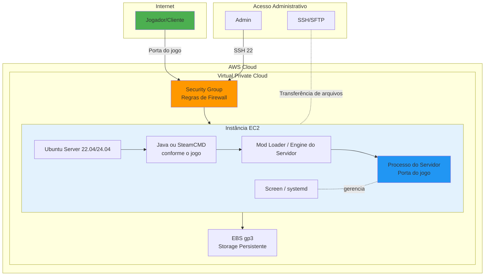

# 🏗️ Arquitetura

## Visão Geral

O padrão de arquitetura usado neste projeto é o mesmo independente do modpack, loader, ou até do jogo: uma instância EC2 exposta pela porta certa, com o processo do servidor mantido vivo em background, e storage persistente em EBS.

## Diagrama (padrão genérico)


```mermaid
graph TB
    subgraph Internet
        A[Jogador/Cliente]
    end

    subgraph AWS Cloud
        subgraph VPC[Virtual Private Cloud]
            B[Security Group<br/>Regras de Firewall]

            subgraph EC2[Instância EC2]
                C[Ubuntu Server 22.04/24.04]
                D[Java ou SteamCMD<br/>conforme o jogo]
                E[Mod Loader / Engine do Servidor]
                F[Processo do Servidor<br/>Porta do jogo]
                G[Screen / systemd]

                C --> D
                D --> E
                E --> F
                G -.gerencia.- F
            end

            H[EBS gp3<br/>Storage Persistente]

            B --> EC2
            EC2 --> H
        end
    end

    subgraph Acesso Administrativo
        I[Admin]
        J[SSH/SFTP]
    end

    A -->|Porta do jogo| B
    I -->|SSH 22| B
    J -.Transferência de arquivos.- EC2

    style A fill:#4CAF50
    style F fill:#2196F3
    style B fill:#FF9800
    style EC2 fill:#E3F2FD
```

## Exemplo atual aplicado: Cobbleverse (Fabric)

```
Cliente:     Minecraft 1.21.1, modpack COBBLEVERSE (Cobblemon)
Loader:      Fabric
Instância:   t3.large (2 vCPUs, 8 GiB RAM)
SO:          Ubuntu Server 22.04/24.04 LTS
Java:        21 OpenJDK
RAM da JVM:  -Xmx6G -Xms6G
Processo:    screen (sessão "minecraft")
Storage:     EBS gp3, 20-30 GiB
Porta:       TCP 25565
```

Veja a ficha completa em [`case-studies/cobbleverse.md`](../case-studies/cobbleverse.md). Para os casos anteriores (Forge e NeoForge), veja os outros arquivos em [`case-studies/`](../case-studies/).

## Componentes

### Security Group
Firewall virtual da instância. Regra mínima de entrada: SSH (22, restrito ao seu IP) + porta do jogo (variável, `0.0.0.0/0`).

### Instância EC2
Dimensionada conforme o [guia de sizing](../guides/02-sizing-guide.md) — a categoria do modpack (leve/médio/pesado) determina o tipo de instância, não o contrário.

### Storage (EBS)
```
~/minecraft-server/  (ou equivalente para outros jogos)
├── world/          # Mundo do jogo
├── mods/           # Mods (Forge/NeoForge/Fabric)
├── config/         # Configurações dos mods
├── logs/           # Logs do servidor
└── ~/backups/      # Backups (ver scripts/backup-world.sh)
```

### Gerenciamento de Processo
`screen` é suficiente para a maioria dos casos pessoais/educacionais (simples, permite console interativo, sobrevive a desconexão SSH). Para um setup que precisa sobreviver a reboots automaticamente, `systemd` é a evolução natural — não implementado neste projeto ainda, mas é uma melhoria planejada (veja "Próximos Passos" abaixo).

## Decisões Arquiteturais — Como Pensar, Não Só o Que Escolhemos

| Decisão | Pergunta a fazer | Trade-off típico |
|---|---|---|
| Tipo de instância | Quanto de RAM o pack/jogo recomenda oficialmente? | Mais RAM = mais custo, mas evita OOM/crash |
| Mod loader | O modpack já define isso — qual ele usa? | Não é escolha livre; é definido pelo pack |
| SO | Familiaridade com o gerenciador de pacotes? | Ubuntu (APT) tem mais documentação que Amazon Linux |
| Storage | Tamanho do mundo + mods + margem de backup | gp3 20-40 GiB cobre a maioria dos casos pessoais |
| Gerenciador de processo | Precisa sobreviver a reboot automático? | screen = simples; systemd = robusto |

## Segurança

**Camadas:**
1. Security Group (whitelist de portas, IP restrito para SSH)
2. SSH com autenticação por chave (sem senha, sem login root direto)
3. Autenticação do próprio jogo (online-mode no Minecraft, whitelist, etc.)

**Riscos conhecidos e mitigação:**
- Porta do jogo aberta publicamente é, por definição, um alvo possível — mitigação básica é o AWS Shield padrão (gratuito) e manter o software atualizado
- Backup manual até a implementação do script de backup automatizado — mitigado por [`scripts/backup-world.sh`](../scripts/backup-world.sh)

## Custos

Veja a tabela completa em [`guides/02-sizing-guide.md`](../guides/02-sizing-guide.md). No AWS Academy, o custo sai do crédito da disciplina — pare a instância quando não estiver em uso para não desperdiçar esse crédito.

## Próximos Passos (melhorias planejadas)

1. **systemd** em vez de `screen`, para reinício automático após reboot/crash
2. **Backup automatizado via cron**, usando `scripts/backup-world.sh` (script já existe — falta o agendamento)
3. **CloudWatch Alarms** básicos (CPU > 90%, disco > 80%)
4. Suporte documentado a mais jogos não-Minecraft (ver [`guides/06-other-games.md`](../guides/06-other-games.md), ainda em nível introdutório)
